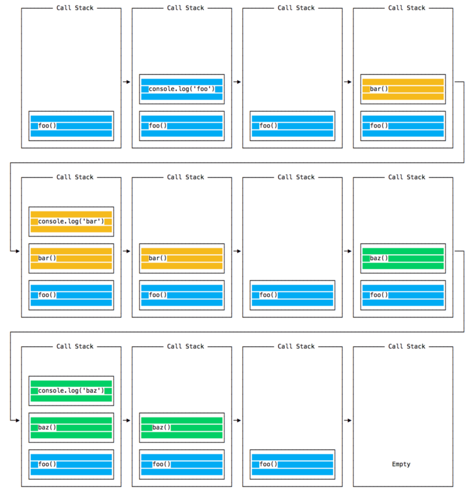
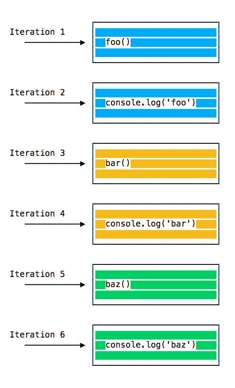
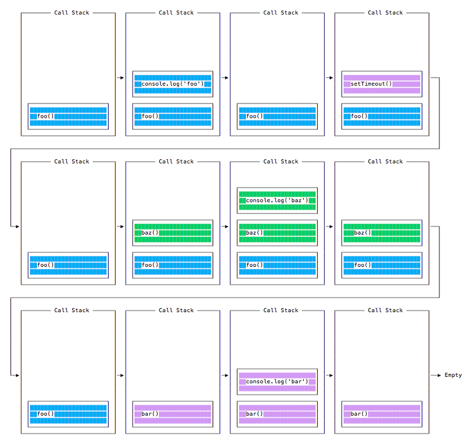

<h1 align="center">  TRABALHANDO COM O EVENT LOOP </h1>

## O Event Loop

### O Loop de Eventos é um dos mais importantes conceitos para entender sobre JavaScript. Este post explica isso nos termos simples.

- [Introdução](#introduction)
- [Bloqueando o event loop](#event-loop-blocking)
- [A pilha de chamadas (call stack)](#call-stack)
- [Uma explicação simples do event loop](#event-loop-explanation)
- [Execução das funções em fila](#queuing-function)
- [A Fila de Mensagens](#message-queue)
- [Fila de tarefas do ES6](#es6-job-queue)

## <a name="introduction"></a> Introdução

 O **Event Loop** é um dos mais importantes conceitos para entender sobre JavaScript. 

> Programei por anos com JavaScript, no entanto, eu nunca entendi completamente como as coisas funcionam por baixo dos panos. É completamente normal não entender este conceito em detalhe, mas é util saber como ele funciona e você também pode estar um pouco curioso neste momento.

Este post tem como objetivo, explicar os detalhes internos de como o JavaScript funciona em uma única thread e como ele lida com funções assíncronas.

Seu código JavaScript é executado em uma thread única. Há apenas uma coisa acontecendo de cada vez.

Está limitação é realmente muito útil, pois simplifica muito a maneira como você programa, sem se preocupar com problemas de concorrência. 

Você só precisa prestar atenção na forma como escreve seu código e evitar qualquer coisa que possa bloquear a thread, como chamadas de rede síncronas ou [loops](https://flaviocopes.com/javascript-loops/) infinitos.

No geral, a maioria dos navegadores tem um event loop em cada aba. Isolando todos os processos e evitando que uma página Web tenha loops infinitos ou processamento pesado travando o navegador.

Por exemplo, para manipular chamadas de API, o ambiente do navegador gerencia vários event loops simultâneos. 

Os [Web Workers](https://flaviocopes.com/web-workers/) também são executados em seu próprio event loop.

Você precisa principalmente se preocupar com o fato de seu código ser executado em um único event loop e escrever o código com isso em mente para evitar bloqueá-lo.

## <a name="event-loop-blocking"></a> Bloqueando o event loop

Qualquer código JavaScript que demore muito para retornar o controle ao event loop, bloqueará a execução de qualquer código JavaScript na página, bloqueando até mesmo a thread de interface do usuário, impedindo o usuário de clicar, rolar a página e assim por diante.

Quase todas as primitivas de E/S em JavaScript são não bloqueantes. Solicitações de rede, operações do sistema de arquivos do [Node.js](https://flaviocopes.com/nodejs/). O bloqueio é a exceção, é por isso que o Javascript se baseia tanto em callbacks, e mais recentemente, em [Promises](https://flaviocopes.com/javascript-promises/) e [Async/Await](https://flaviocopes.com/javascript-async-await/).

## <a name="call-stack"></a> A pilha de chamadas (call stack)

A pilha de chamadas é uma fila LIFO (Ultimo a entrar e primeiro a sair).

O event loop verifica continuamente a pilha de chamadas para ver se há alguma função que precise ser executada.

Enquanto faz isso, ele adiciona qualquer chamada de função que encontra à pilha de chamadas e executa cada uma na ordem.

Você conhece a stack de erros que você normalmente usa, no debugger ou no console do navegador? O navegador consulta os nomes das funções na pilha de chamadas para informar você qual função originou a chamada atual.


## <a name="event-loop-explanation"></a> Uma explicação simples do event loop

Vamos ver este exemplo:

```javascript
const bar = () => console.log('bar')

const baz = () => console.log('baz')

const foo = () => {
  console.log('foo') 
  bar() 
  baz()
}

foo()
```

Este código imprime:

```
foo
bar
baz
```

como esperado.

Quando esse código é executado, o primeiro `foo()` é chamado. Dentro de `foo()` primeiro chamamos `bar()`, depois chamamos `baz()`.

Nesse ponto, a pilha de chamadas está assim:



O event loop em cada iteração verifica se há algo na pilha de chamadas e o executa:



até que a pilha de chamadas esteja vazia.

## <a name="queuing-function"></a> Execução das funções em fila

O exemplo acima parece normal, não há nada de especial nisso: JavaScript encontra coisas para executar e as executa na ordem.

Vamos ver como adiar uma função até que a pilha esteje vazia.

O caso de uso `setTimeout(() => {}), 0)` é para chamar uma função, mas somente executá-la quando todas as outras funções do código forem executadas. 

Veja este exemplo:

```
const bar = () => console.log('bar')

const baz = () => console.log('baz')

const foo = () => {
  console.log('foo')  
  setTimeout(bar, 0)  
  baz()
}

foo()
```

Esse código imprime, talvez surpreendentemente:

```
foo
baz
bar
```

Quando esse código é executado, o primeiro `foo()` é chamado. Dentro de `foo()`, chamamos o primeiro `setTimeout`, passando `bar` como argumento e instruímos a executar imediatamente o mais rápido possível, passando `0` para o cronômetro.
Então chamamos `baz()`.

Nesse ponto, a pilha de chamadas está assim:



Aqui está a ordem de execução de todas as funções em nosso programa:


Por que isso está acontecendo ?

## <a name="message-queue"></a> A Fila de Mensagens

Quando `setTimeout()` é chamado, o Navegador ou o Node.js inicia o cronômetro. Quando o cronômetro expirar, neste caso imediatamente, pois colocamos `0` como tempo limite, a função callback é colocada na **Fila de Mensagens**.

A Fila de Mensagens também é onde os eventos iniciados pelo usuário, como eventos de clique, teclado ou respostas da [fetch-api](https://flaviocopes.com/fetch-api/) são colocados antes que seu código tenha a oportunidade de reagiar a eles. Ou também eventos do [DOM](https://flaviocopes.com/dom/) como o `onLoad`.

**O loop dá prioridade à pilha de chamadas. Primeiro, processa tudo que encontra na pilha de chamadas e, como não há nada lá, ele captura as coisas na fila de mensagens.**

Não precisamos esperar por funções como `setTimeout`, `fetch` ou outras coisas façam seu próprio trabalho, porque elas são fornecidas pelo navegador e elas vivem em suas próprias threads. Por exemplo, se você definir o tempo limite de `setTimeout` para 2 segundos, não precisará esperar 2 segundos, a espera ocorrerá em outro lugar.

## <a name="es6-job-queue"></a> Fila de tarefas do ES6

O [ECMAScript 2015](https://flaviocopes.com/ecmascript/) introduziu o conceito de fila de tarefas, usada pelo `Promises` (também introduzida no ES2015). É uma maneira de executar o resultado de uma função assíncrona o mais rápido possível, em vez de ser colocada no final da pilha de chamadas.

As Promises que finalizarem antes que a função atual termine, serão executadas logo após a função atual.

Acho legal a analogia de uma montanha-russa em um parque de diversões: a fila de mensagens coloca você de volta na fila com todas as outras pessoas da fila, enquanto a fila de tarefas é o bilhete rápido que te permite ir de novo logo depois que você terminou a volta anterior.

Exemplo:

```
const bar = () => console.log('bar')

const baz = () => console.log('baz')

const foo = () => {
  console.log('foo')
  setTimeout(bar, 0)
  newPromise((resolve, reject) =>
    resolve('deve estar após baz e antes de bar')
  ).then(resolve => console.log(resolve))
  baz()
}

foo()
```

Isso imprime:

```
foo
baz
deve estar após baz e antes de bar
bar
```

Essa é uma grande diferença entre Promises e o Async/await, que é baseado em Promises, e explica as funções assíncronas antigas através do `setTimeout()` ou de outras plataformas de APIs.
